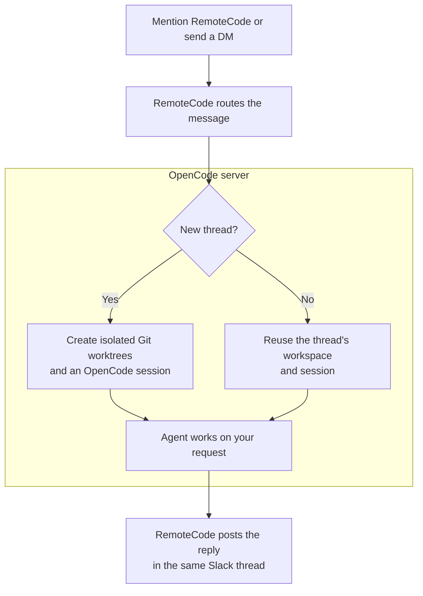

# RemoteCode

A coding agent you talk to in Slack, powered by an OpenCode v2 server.
Mention it in a channel or send it a DM. It works on your repositories and replies in the thread.

> [!IMPORTANT]
> Parts of this codebase are fully vibed. Don't trust it blindly: review the code and test it
> before giving it access to repositories or credentials you care about.

## From Slack to code



Slack reactions track progress: ⚙️ setting up → 👀 working → ✅ finished or ❌ failed.

**One thread, one session, one workspace.** Follow-ups keep the conversation history and code
changes. A new top-level DM starts a separate thread.

```text
Slack                         OpenCode server
Thread A ──────────────────── Session A + workspace A
                              ├── repo-one/  (Git worktree)
                              └── repo-two/  (Git worktree)
Thread B ──────────────────── Session B + workspace B
                              ├── repo-one/  (Git worktree)
                              └── repo-two/  (Git worktree)
```

## How to make it more powerful

Give the agent access to the tools you use to investigate problems. OpenCode v2 uses
[Code Mode for MCP servers](https://opencode.ai/v2/docs/mcp-servers) by default, so agents can
discover and call tools without loading every tool's full schema into the context window up
front. That makes MCPs a relatively cheap way to give the agent more capabilities.

A useful starting set:

- A Slack MCP server to search past discussions, incident threads, and decisions beyond the
  current conversation.
- Observability MCP servers for error tracking, logs, metrics, and traces, so the agent can
  connect a reported symptom to what's actually failing.
- Infrastructure CLIs on the OpenCode server's machine to inspect services, deployments,
  and running workloads.
- A database or warehouse CLI to query analytics data and check how many users or events
  a problem affects.

Configure MCP servers in OpenCode and make the CLIs available and authenticated on its host.
Together with your repositories, these tools let the agent go from a Slack bug report to the
relevant discussion, production evidence, and source code in one thread. That's where RemoteCode
gets especially useful for debugging and quick fixes.

## Git workspaces

For each new thread, RemoteCode uses OpenCode's remote shell API to discover Git repositories
directly under `REPOS_ROOT`, fetch each repository's `origin/main`, and create one detached
worktree per repository under `WORKSPACE_ROOT/sessions`.
Existing threads keep their original worktrees and changes. Both paths live on the OpenCode
server's machine; RemoteCode needs no filesystem access to them.

Repositories must be immediate children of `REPOS_ROOT`, have an `origin` remote, and expose
`origin/main`. The checked-out branch and files in each source working copy are never changed.
If fetching fails because the remote returns HTTP 5xx, provisioning falls back to the repository's
local `main` branch. Other fetch errors remain fatal.

## How Thread Context Works

The first mention sends every message except RemoteCode's own messages in the Slack thread to a new
OpenCode session. Each later message sends only messages added since the previous turn. OpenCode
retains its own assistant and tool history, so prior content is neither duplicated nor reordered
and the model's prompt prefix remains cacheable.

No database is required. The active process caches thread state in memory. For restart recovery,
the app finds generated `[slack]` sessions and matches the Slack thread and last imported message IDs
from OpenCode prompt metadata.

## Slack Setup

1. Start an OpenCode v2 service and make its authenticated HTTP API reachable by RemoteCode.
2. Create a Slack app from [`slack-manifest.yaml`](./slack-manifest.yaml).
3. Under **Basic Information > App-Level Tokens**, create a token with `connections:write`.
4. Install the app into the workspace and invite it to channels where it should work.
5. Create `.env` from `.env.example`. Set `SLACK_BOT_TOKEN` (`xoxb-...`), `SLACK_APP_TOKEN`
   (`xapp-...`), and `OPENCODE_PASSWORD` to the Basic auth password used by the running OpenCode
   server.
6. Run `bun install`, then `bun run start`.

In channels, a mention subscribes the app to the thread. Mentions always trigger the agent;
untagged replies from allowed users are evaluated by Jev (`~typesafe/jev-latest`) through OpenRouter
using AI SDK's `experimental_evaluate`. The gate uses up to 20 recent messages, including the
assistant's replies. It separately evaluates whether a response/action is needed, whether the bot
is addressed, whether its task is being continued, and whether someone else is the exclusive
recipient. It requires the first and either the second or third (each at probability ≥ 0.7),
and skips replies when the exclusive-other-recipient probability is ≥ 0.7. Evaluation errors or timeouts
skip the reply and are logged. DMs bypass evaluation. Subscriptions are kept in memory, so
after a restart, tag the app again to resume listening. Existing Slack apps must enable the
`message.channels` and `message.groups` bot events from the manifest.

DMs do not require a tag. A DM thread reply continues that thread's session; a new top-level DM
starts a separate session.

## Configuration

| Variable               | Default                 | Purpose                                                                   |
| ---------------------- | ----------------------- | ------------------------------------------------------------------------- |
| `SLACK_BOT_TOKEN`      | required                | Single-workspace bot token                                                |
| `SLACK_APP_TOKEN`      | required                | Socket Mode app token                                                     |
| `SLACK_BOT_NAME`       | `remotecode`            | Mention username used by Chat SDK                                         |
| `ALLOWED_SLACK_USERS`  | empty                   | Allowed user IDs; empty denies all mentions                               |
| `OPENCODE_URL`         | `http://127.0.0.1:4096` | OpenCode v2 server                                                        |
| `REPOS_ROOT`           | `~/repos`               | Root containing source Git repositories                                   |
| `WORKSPACE_ROOT`       | `~/remotecode`          | Isolated thread workspaces                                                |
| `OPENROUTER_API_KEY`   | optional                | Enables additional smart features like responding to unmentioned messages |
| `OPENCODE_AGENT`       | `build`                 | OpenCode agent                                                            |
| `OPENCODE_MODEL`       | `openai/gpt-6-sol-fast` | Main model in `provider/model` form                                       |
| `OPENCODE_SMALL_MODEL` | `openai/gpt-6-luna`     | Utility model in `provider/model` form                                    |
| `OPENCODE_EFFORT`      | `medium`                | Model variant/effort, such as `high`                                      |
| `OPENCODE_USERNAME`    | `opencode`              | OpenCode Basic auth username                                              |
| `OPENCODE_PASSWORD`    | required                | OpenCode Basic auth password                                              |

## Local Mock

After configuring `OPENCODE_PASSWORD`, run `bun run dev` to exercise the full Chat SDK and OpenCode
path without Slack credentials. Every normal line is treated as a mention. Useful commands:

```text
/say untagged message (evaluated after the thread's first mention)
/thread another-thread
/quit
```

Each mock thread maps to an independent OpenCode session, matching Slack behavior.

## Docker Compose

The included [`compose.yaml`](./compose.yaml) runs the local mock in a Docker container and mounts the
repository for live code changes. Copy `.env.example` to `.env`, set `OPENCODE_PASSWORD`, start the
local OpenCode service, then run:

```bash
docker compose run --rm dev
```

The service uses `network_mode: host`, so the default `OPENCODE_URL=http://127.0.0.1:4096` reaches
OpenCode on the host. This setup requires Docker host-networking support and is intended for Linux.
The placeholder Slack tokens in `compose.yaml` are only used to satisfy configuration validation;
the local mock does not connect to Slack. Repository and workspace mounts are unnecessary because
all filesystem operations run through the OpenCode server.

## Checks

```bash
bun run typecheck
bun run lint
bun run format:check
bun test
```
